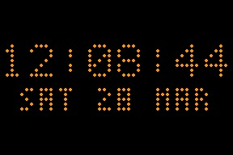
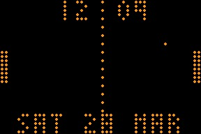
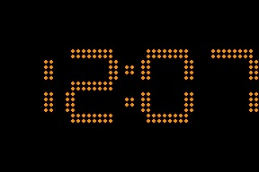

# PongClock CYD

A port of Nick Hall's classic **Pong Clock** to the **ESP32-2432S028R (Cheap Yellow Display)**. The original drove two Sure Electronics 2416 LED panels (48×16 combined). This version emulates a 48×32 virtual LED matrix on the ILI9341 320×240 TFT — each virtual LED is a 6×6 rounded rectangle in amber, giving a retro LED panel aesthetic.

Original project: http://123led.wordpress.com/

---

## Gallery

|                                             |                                           |
|:-------------------------------------------:|:-----------------------------------------:|
|         |         |
| **Slide** — digits slide on each tick       | **Pong** — AI game, score = HH:MM         |
|       |   |
| **Digits** — large 10×14 font, HH:MM        | **Word Clock** — time in words + date     |

---

## Features

- NTP time sync via WiFi (ezTime — timezone + POSIX DST fallback in `config.h`)
- WiFiManager captive portal for first-run credential entry
- Animated splash screen on boot (typewriter reveal + CRT-collapse exit, ≈2.3 s)
- Four clock modes with touch-to-switch; date always on screen
- Long-press anywhere for brightness cycle (4 levels); optional LDR auto-brightness
- Retro amber LED look — 6×6 rounded pixel per virtual LED, 48×32 matrix
- HTTP web server — live screenshot, hardware mockup page, `/api/info` JSON

---

## Clock Modes

| # | Mode          | Description                                                          |
|:--|:--------------|:---------------------------------------------------------------------|
| 0 | **Slide**     | Each digit slides up on change — HH:MM:SS; date row permanently below |
| 1 | **Pong**      | AI pong — score = HH / MM; date permanently at bottom of field       |
| 2 | **Digits**    | Large 10×14 font — HH:MM with flashing colon                         |
| 3 | **Word Clock**| Time in words + date (e.g. "TWENTY PAST / FIVE / WED 18 MAR")       |

Clock starts in **Slide** mode on every boot.

---

## Touch Controls

The touchscreen is divided into two halves:

```
┌─────────────────┬─────────────────┐
│                 │                 │
│   Tap here      │   Tap here      │
│  ◄ PREV mode    │   NEXT mode ►   │
│                 │                 │
└─────────────────┴─────────────────┘
         Hold anywhere ≥ 0.6 s
              = Brightness cycle
```

| Touch                  | Action                                            |
|:-----------------------|:--------------------------------------------------|
| Short tap — left half  | Previous mode                                     |
| Short tap — right half | Next mode                                         |
| Hold ≥ 600 ms          | Cycle brightness (4 levels: dim → mid → bright → max) |

---

## Web Interface

When WiFi is connected a web server starts on port 80. Open `http://<device-ip>/` in a browser — the IP is printed to serial at boot.

| Endpoint            | Returns                                              |
|:--------------------|:-----------------------------------------------------|
| `/`                 | CYD hardware mockup with live screenshot, 2 s refresh |
| `/screenshot.bmp`   | Current display as 24-bit BMP (288×192), download    |
| `/api/info`         | JSON — mode, brightness, uptime, freeHeap, IP        |

Example `/api/info` response:

```json
{
  "firmware": "0.4",
  "mode": 1,
  "modeName": "Pong",
  "brightness": 180,
  "uptime": 3742,
  "freeHeap": 187456,
  "ip": "192.168.1.26"
}
```

The server is offline-safe: `initWeb()` is a no-op if WiFi did not connect.

---

## Hardware

- **Board:** ESP32-2432S028R (CYD — Cheap Yellow Display)
- **Display:** ILI9341 · 320×240 · SPI (HSPI — MOSI=13, SCLK=14, CS=15, DC=2)
- **Touch:** XPT2046 · dedicated VSPI bus (CLK=25, MISO=39, MOSI=32, CS=33)
- **Backlight:** GPIO 21 via LEDC PWM
- **No hardware modifications required** — standard CYD pinout throughout

---

## Build & Flash

```bash
# Build only
pio run

# Build and upload
pio run --target upload

# Serial monitor (115200 baud)
pio device monitor --baud 115200
```

---

## First Boot

1. Flash the firmware.
2. The screen shows **"Connecting WiFi..."** — a `CYD-PongClock` access point appears.
3. Connect your phone to `CYD-PongClock` and enter your WiFi credentials in the captive portal.
4. Device reboots, connects, and shows **"Syncing NTP..."**.
5. Once synced, the clock starts in **Slide** mode showing the correct local time.
6. The web server starts — IP is shown in serial (`[INFO] Web server started — http://…`).

If WiFi times out (60 s) the clock continues offline; the web server is skipped.

---

## Configuration

All tuneable constants are in [`include/config.h`](include/config.h).

### Time & Location

| Constant              | Default              | Purpose                      |
|:----------------------|:---------------------|:-----------------------------|
| `NTP_TIMEZONE`        | `"Australia/Sydney"` | Olson timezone name          |
| `NTP_SYNC_TIMEOUT_S`  | `20`                 | Seconds to wait for NTP sync |
| `AMPM_MODE`           | `0`                  | 0 = 24 h, 1 = 12 h           |

### Display

| Constant               | Default   | Purpose                           |
|:-----------------------|:----------|:----------------------------------|
| `BRIGHTNESS_DEFAULT`   | `180`     | Startup backlight PWM (0–255)     |
| `BRIGHTNESS_STEPS`     | `4`       | Levels cycled by long-press       |
| `COLOUR_LED_ON_R/G/B`  | 255/140/0 | Amber — lit LED colour            |
| `COLOUR_LED_OFF_R/G/B` | 20/8/0    | Dark amber — unlit LED colour     |

### Web Server

| Constant          | Default | Purpose                  |
|:------------------|:--------|:-------------------------|
| `WEB_SERVER_PORT` | `80`    | HTTP port for web server |

### Animation

| Constant          | Default | Purpose                             |
|:------------------|:--------|:------------------------------------|
| `SLIDE_DELAY`     | `20`    | ms per frame in Slide animation     |
| `PONG_BALL_DELAY` | `20`    | ms per frame in Pong mode           |
| `FADE_DELAY`      | `25`    | ms per step in mode-transition fade |

### Touch Calibration

| Constant              | Default | Purpose                                 |
|:----------------------|:--------|:----------------------------------------|
| `TOUCH_PRESSURE_MIN`  | `200`   | Minimum Z to register a touch           |
| `TOUCH_X_LEFT`        | `200`   | Raw X at left screen edge               |
| `TOUCH_X_RIGHT`       | `3800`  | Raw X at right screen edge              |
| `TOUCH_LONG_PRESS_MS` | `600`   | Hold duration (ms) for brightness cycle |

If taps aren't registering on the correct side, check serial for raw `x=` values and adjust `TOUCH_X_LEFT` / `TOUCH_X_RIGHT`.

### Date Display

| Constant            | Default | Purpose                                          |
|:--------------------|:--------|:-------------------------------------------------|
| `DATE_DISPLAY_MINS` | `10`    | Minutes between date displays (Pong/Digits/Word) |

### Auto-Brightness (LDR)

Disabled by default (`LDR_ENABLED=0`). Set to `1` in `config.h` to enable automatic backlight control via the CYD's built-in light sensor on GPIO 34.

| Constant         | Default | Purpose                                        |
|:-----------------|:--------|:-----------------------------------------------|
| `LDR_ENABLED`    | `0`     | 1 = auto-brightness; 0 = long-press only       |
| `LDR_PIN`        | `34`    | ADC pin for LDR (input-only, do not change)    |
| `LDR_DARK`       | `200`   | ADC value → `BRIGHTNESS_MIN`                   |
| `LDR_BRIGHT`     | `2500`  | ADC value → `BRIGHTNESS_MAX`                   |
| `BRIGHTNESS_MIN` | `15`    | Minimum backlight PWM in auto mode             |
| `BRIGHTNESS_MAX` | `255`   | Maximum backlight PWM in auto mode             |
| `LDR_SAMPLES`    | `8`     | Rolling-average depth (smooths ADC noise)      |
| `LDR_UPDATE_MS`  | `5000`  | ms between LDR samples                         |

When auto-brightness is enabled the long-press cycle still works but is overridden on the next LDR sample.

### Debug

| Constant            | Default | Purpose                                      |
|:--------------------|:--------|:---------------------------------------------|
| `DEBUG_LEVEL`       | `3`     | 1=Error 2=Warn 3=Info 4=Verbose (build flag) |
| `DEBUG_SLIDE_TIME`  | `1`     | Print `[Slide] HH:MM:SS` on each tick        |
| `DEBUG_DIGITS_TIME` | `1`     | Print `[Digits] HH:MM` on each minute        |
| `DEBUG_PONG_TIME`   | `1`     | Print `[Pong] HH:MM:SS` on each rally        |
| `DEBUG_WORD_TIME`   | `1`     | Print `[Word] HH:MM` on each minute          |

Set any `DEBUG_*_TIME` to `0` to suppress that mode's output.

---

## Serial Output Reference

Typical boot sequence:

```
[INFO] === PongClock CYD starting ===
[INFO] Display initialised 320x240 rotation=1
[INFO] Display colours initialised, sprite 288x192 depth=8 heap=198232
[INFO] Touch initialised (VSPI CLK=25 MISO=39 MOSI=32 CS=33)
[INFO] WiFi connected: 192.168.1.26
[INFO] Time synced: 16:29:42 17-Mar-2026  status=2  tz=AEDT offset=+1100
[INFO] Web server started — http://192.168.1.26/
[INFO] Free heap: 187456 bytes
[INFO] Slide mode entry: 16:29:42  NTP status=2
[INFO] [Slide] 16:29:43
[INFO] Touch tap: raw x=2847 y=1203 z=512  (mid=2000 → NEXT mode)
```

NTP `status=2` = synced. `status=0` = not set (offline).

If the Olson timezone lookup fails (timezoneapi.io HTTP call), a `[WARN]` is logged and the POSIX fallback is applied — time will still be correct.

---

## Credits

- Original Pong Clock by **Nick Hall** — http://123led.wordpress.com/
- Modifications by **Brett Oliver** (v7.x) — https://www.brettoliver.org.uk/Pong_Clock/Pong_Clock.htm
- CYD port using [TFT_eSPI](https://github.com/Bodmer/TFT_eSPI) by Bodmer
